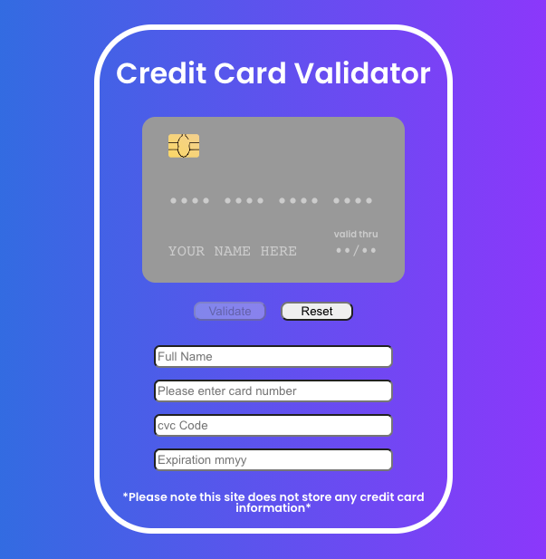

# Mark Novak
> This is a simple web app to validate credit cards utilizing the Luhn Method. Please note no credit card information is stored.

## Table of contents
* [General info](#general-info)
* [Screenshots](#screenshots)
* [Technologies](#technologies)
* [Setup](#setup)
* [Features](#features)
* [Status](#status)
* [Contact](#contact)

## General info
> Simple web app validating credit card numbers with the Luhn Method.

## Screenshots


## Technologies
* React
* JavaScript
* HTML
* CSS
* sweetalert2


## Setup
Please follow link to website - https://manovak24.github.io/credit_card_validator/

## Code Examples
```js
    checkCardNumber() {
            let card = this.state.cardNumber;
            card = card.split('').join(', ');
            const cardToArr = card.split(',').map(function(item) {
                return parseInt(item, 10);
            })

            cardToArr.slice();
            for (let i = (cardToArr.length - 2); i >= 0; i = i -2) {
                cardToArr[i] = cardToArr[i] * 2;
                if (cardToArr[i] > 9) {
                    cardToArr[i] = cardToArr[i] -9;
                }
            }
            let arraySum = cardToArr.reduce((acc, cur) => acc + cur);
            if (arraySum % 10 === 0) {
                this.setState({results: 'valid'})
            } else {
                this.setState({results: 'not valid'})
            }
        }
 ```   

## Features
List of features ready
* Web app validates credit card numbers


## Status
Project is: _in progress_

## Contact
Created by [@manovak24](https://github.com/manovak24) - feel free to contact me!